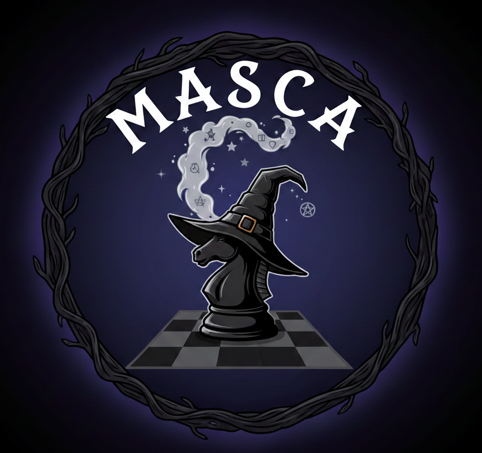

# Masca - Rust Chess Engine

Just started coding this chess engine, called "masca". A masca is a witch from the folklore of Piedmont / western Alps. Masche can turn into animals such as horses, as shown in the engine logo below.

Work in progress!

